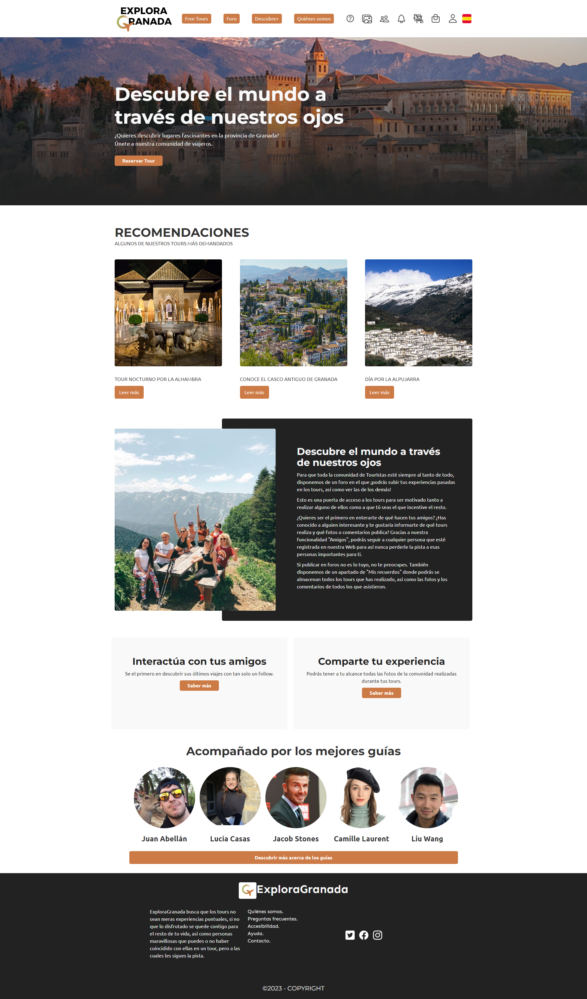

# DIU - Practica 3, entregables

## Moodboard (diseño visual + logotipo)   
Hemos creado un tablón inspiracional dónde hemos recogido ideas para realizar el estilo visual de nuestra aplicación **Explora Granada**. En él, hemos definido los posibles logotipos a usar, nuestra tipografía, paleta de colores, labeling de iconos y varias fotos de inspiración. Los desarrollaremos a continuación.

### Logotipo
Para ello se ha seleccionado una imagen de un avión para que el usuario entienda rapidamente que se trata de una web de turismo y la hemos modificado para que tenga forma de una 'G'. Además se le ha añadido los colores de nuestra paleta y el nombre de la web para un reconocimiento sencillo.

Tenemos cuatro variantes del logotipo:

   - Isologotipo para una fácil distinción de la marca en modo claro
   - Isologotipo para modo oscuro
   - Logo más sencillo para modo claro
   - Logo para modo oscuro
   
  
## Landing Page
Buscamos una presentación de nuestro proyecto de una manera atractiva para el usuario. Para ello, nos hemos ayudado de la herramienta [WebFlow](https://webflow.com). Se puede visualizar comodamente a través de este [enlace](https://deniss-stupendous-site-03-4c32b55860345.webflow.io/#https://deniss-stupendous-site-03-4c32b55860345.webflow.io/)

Hemos incluido nuestro isologotipo, logo y un formulario para un registro a la web cómodo y rápido. Además se ha realizado una exposición de nuestros servicios más llamativos:

 - Nuestro catálogo de tours
 - La posibilidad de poder conocer a nuestros guías e incluso hacer un seguimiento de estos.
 - La comunidad formada por clientes y guías dónde se puede compartir las experiencias, seguir entre usuarios e incluso tener una galería compartida de los tours realizados.

## Guidelines
### Paleta de colores
Nuestra paleta de colores viene formada por cinco colores, son los siguientes:

- **Blanco** `#FDFCFB`
- **Cián profundo** `#4D666B`
- **Naranja** `#CC7B46`
- **Azul suave** `#A5C0C8`
- **Verde suave** `#AAB763`

Los colores han sido elegidos estrategicamente para que estos recuerden al usuario a la naturaleza, aire libre, viajes... 
El color blanco lo contrastaremos con negro para la parte principal. Por el contrario, para realiar el modo oscuro utilizaremos el color Cían profundo junto al blanco como contraste. Para los botones usaremos el naranja junto al blanco para el contraste. El color verde suave junto al blanco lo usaremos para destacados de la página en modo claro y para el modo escuro se usará el azul suave junto al negro.

### Iconografía
Hemos utilizado los iconos de la [Iconic](https://ionic.io/ionicons/) para neustra página web. Son iconos simples, sencillos e intuitivos para la comodidad del usuario.

### Tipografías
Para nuestra tipografía hemos elegido un tipo de letra claro y sencillo que resulte cómodo al usuario. Con esto evitaremos problemas para acceder a nuestra web por parte del cliente con problemas visuales. 

   - **Cabecera (H1)** : La fuente elegida es Montserrat con tamaño 62, será utlizada principalmete para descatar nuestro logo.
   - **Subcabecera (H2)** : Usaremos Montserrat con tamaño 40 para señalar nuestros subapartados.
   - **Subcabecera (H3)** : La fuente será Ubuntu con tamaño 18, principalmente se utilizará para el tamaño de los botones de toda la páguina, es la misma fuente que la del cuerpo pero con un tamaño mayor para resaltar estas funcionalidades.
   - **Cuerpo** : Para la mayor parte de nuesstro texto utilizaremos Ubuntu 16, una letra clara y bastante legible.

### Patrón de diseño
Principalmente hemos utilizado el patrón de diseño en franjas horizontales. Cada franja actúa a modo de pantalla completa (o casi) y convierte su contenido en una sorpresa para el usuario cada vez que hace scroll. 

Tanto para el landing page como para el inicio de la página princial también se utlizado el patrón F. Es decir, la sección superior horizontal de la página recibe gran parte de nuestra atención y, a continuación, dejamos caer nuestra mirada verticalmente hacia la izquierda que se convierte en nuestro punto de referencia.

### Estilo de lenguaje
El estilo del lenguaje utilizado en la documentación es claro y conciso. Se utilizan frases directas y simples para describir cada elemento. Además, se proporciona información relevante de manera ordenada, lo que facilita la comprensión de los diferentes aspectos del proyecto.

## Mockup: LAYOUT HI-FI
Hemos desarrolado los bocetos realizados en la práctica anterior para dar forma a nuestra web. Se puede visitar en el siguiente [enlace](https://deniss-stupendous-site-0364a1.webflow.io/)

Página Princial:

Página de los guias:

Página de mis recuerdos:

## Documentación: Publicación del Case Study

Puede ver nuestra web en [ExploraGranada](https://deniss-stupendous-site-0364a1.webflow.io/)

En conclusión, hemos conseguido darle forma a nuestra web. Esta ha sido una tarea algo laboriosa que nos ha llevado bastante esfuerzo y tiempo realizar, aunque finalmente hemos obtenido un buen resultado. Es primordial seguir los pasos de investigación indicados para su ejecución para obtener un correcto trabajo.

 
