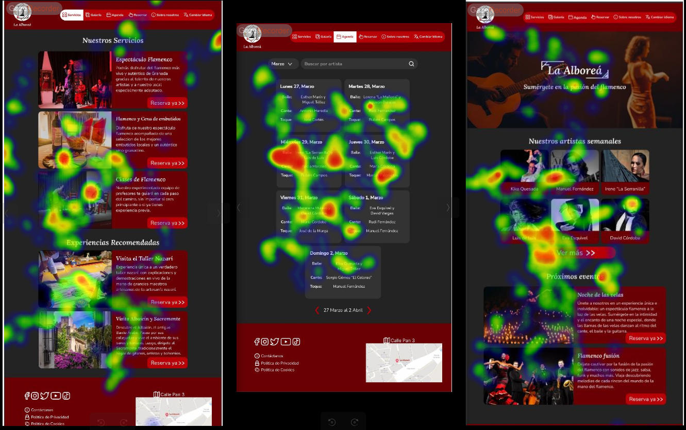
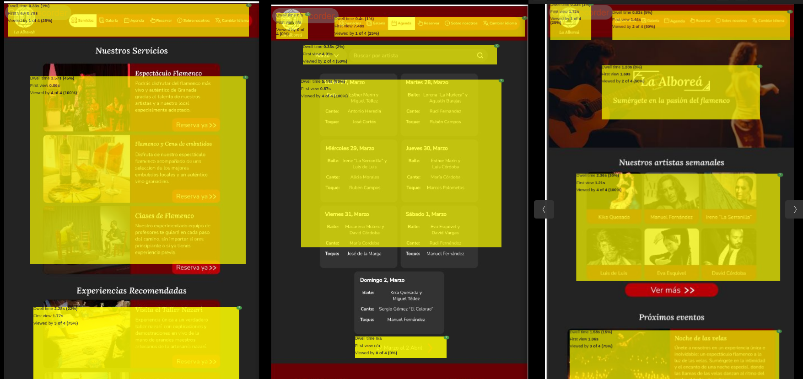

# DIU - Practica 4, entregables

Las aplicaciones que bamos a evaluar en esta práctica serán 2. El caso A se refiere a nuestra web y el caso B a "La Alboreá", esta última se puede encontrar en este [enlace](https://github.com/Rodrigo23301/DIU-P1/tree/master).

* Users:
Hemos selccionado cuatro usuarios que pertecen a diferentes grupos de edades y que tienen formas de vida completamente distinta para poder valorar correctamente ambas aplicaciones. Estos se detallan en la siguiente tabla:

| Usuarios | Sexo/Edad     | Ocupación   |  Exp.TIC    | Personalidad | Plataforma | TestA/B
| ------------- | -------- | ----------- | ----------- | -----------  | ---------- | ----
| Belén  | M / 17   | Estudiante  | Media       | Extrovertida | móvil       | B 
| Jose Luis  | H / 53   | Fontanero  | Media       | Activo       | Web        | B 
| Valentina | M / 74   | Jubilada   | Baja        | Emocional    | móvil      | A 
| Boris  | H / 24   | DJ  | Media       | Aventurero    | Web        | A 

* A/B Testing. 
Tras la selección de nuestro usuarios, han sido encuestados para poder valorar y comparar nuestros dos casos de estudio. 
Para el caso de estudio tipo A tenemos una puntuación aceptable tipo C para un primer usuario y aceptable tipo A para el segundo usuario. Con esto podemos afirmar que la web es bastante buena y sencilla para el uso de los usuarios.
Sin embargo, para el caso de estudio tipo B se ha obtenido una puntuación marginal D. La web tiene bastante partes a mejorar para un mejor uso por parte de sus clientes. 

* Tareas realizadas 
Para cada una de las tareas a realizar por los usuarios, hemos querido extraer algunos de los puntos clave de la página para determinar si estas funcionalidades son realmente importantes o están pasando a un segundo plano. Para ello, cada usuario ha tenido que marcar con un tic si lo ha hecho o una equis en caso contrario. Las tareas evaluadas han sido las siguientes:

 Reservar actuación.
 Añadir comida o bebida a la actuación.
 Añadir opinión.
 Cancelar reserva.
 Contratar clases.
 Consultar accesibilidad.
 Consultar calendario.
 Buscar un artista específico.
 Visitar la página de nuevo.

Como conclusión podemos determinar que las tareas más importantes son reservar, dejar una opinión y consultar el calendario con las diferentes. Sin embargo, las tarea que menos se han realizado ha sido la de cancelar reserva que en realidad es un punto positivo. 

* Usability Report de Caso B
Para la evaluación de usabilidad de la aplicación “La Alboreá” hemos realizado un informe de la misma. A partir de la información proporcionada por parte de los usuarios que han evaluado la página web “La Alboreá”, hemos podido concluir que la página en rasgos generales está bien organizada y distribuida. Intenta mantener la simetría y la misma relación de columnas. Es decir, tiene una interfaz bien definida y estructurada.

Pero es de importnacia señalar que, la página ofrece los servicios esperados pero ni por asomo de la mejor manera. Hay muchos aspectos que podrían mejorarse ya no a nivel de ofrecer más servicios, lo cuál también le vendría bien. Sino a nivel de ser más atractiva para el ojo del cliente que está interesado en navegar por la misma.

* CaseStudy review
Se ha realizado un checklist del caso B, se puede ver más detalladamente en este [enlace](./UXCaseStudy-review.pdf). La puntuación obtenida es de 61 puntos - Justo pero no brillante. Aunque el resultado final, la app, es buena no se ha desarrollado correctamente ninguna de las prácticas. La documentación es bastante desfavorable e incluso inexistente, como puede ser el caso del reedme principal.

* Estudio de la usabilidad
Para evaluar la usabilidad de la página web hemos utilizado la herramienta Gaze Recorder, que nos permite hacer un estudio de las partes más interesantes para nuestros usarios. Capta lo que obvservan los usuarios en la página para ver así cuales son las partes más interesantes para los mismos. 

Como podemos observar, nadie se fija en el logitpo. Así mismo, muestran más interés en general en mirar los actores que vendrán, todos por igual; mientras que en las páginas donde hay varias actividades solo se fijan en las fotos, mientras que omiten más el texto.

A partir del heatmap obtenemos las siguientes conclusiones:

Todo el mundo se interesa en mirar los servicios que ofrecen; sin embargo, no causa tanto interés la parte posterior a esta "Experiencias Recomendadas", donde algunos la omiten. Así mismo, a todos les interesa ver los siguientes artistas pero solo la mitad ve importante el hecho de poder buscar por nombre. Por último, a todos les causa interés los artistas semanales y los próximos eventos.

* Conclusiones
Tras valorar nuestra web, podemos ver que existe una posibilidad de mejora en lo referido a la navegación por ella, ya que para algunos usuarios más inexpertos le puede dificultad la tarea por la cantidad de contenido y apartados.

Sin embargo, el caso B, necesitaría realizar una interfaz más atractiva y sencilla para el usuario. Existen aspectos bastantes importantes a destacar, como que la paleta de colores empleada puede impedir el uso de la web por parte de personas con problemas visuales. También sería útil añadir una sección de favoritos, una cesta de compra para que el usuario no se pierda por la web. 
