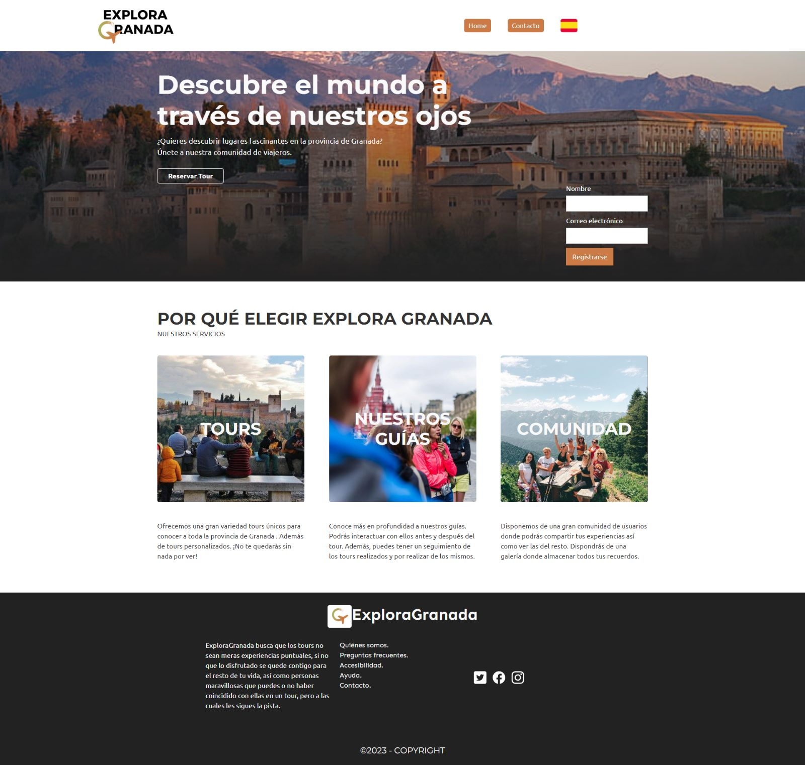

# DIU23
Prácticas Diseño Interfaces de Usuario 2022-23 (Tema: Free Tour ) 

Grupo: DIU2_11Partidazos.  Curso: 2022/23 
Updated: 21/05/2023

Proyecto: Explora Granada

Descripción:  Explora Granada busca fomentar el turismo en la provincia de Granada a través de una página web con una gran variedad de tours personalizados y no tan conocidos. Pero esto no es todo, pues nuestro objetivo es que una vez realizado un tour, no lo olvides de la noche a la mañana, sino que una parte de él se quede contigo. Es por esto que contamos con una funcionalidad de recuerdos, en los que podrás consultar los tours a los que ya has ido con las respectivas fotos de dicho tour subidas por todos los integrantes del mismo. Y para expandirnos aún más... ¡disponemos de una opción de seguimiento entre usuarios! 

Logotipo: 

Miembros
 * :bust_in_silhouette:   Alba Guisado Farnes :octocat: https://github.com/albaguisadof     
 * :bust_in_silhouette:  Denis Valentin Stoyanov D'Antonio :octocat: https://github.com/DenisSValentin

----- 

# Proceso de Diseño 

## Paso 1. UX Desk Research & Analisis 

 1.a Competitive Analysis
-----
Las páginas que heemos comparado son: 
- https://freetour-granada.com/
- https://alboreaflamenco.com/
- https://artesanianazari.es/
 
Tras comparar varios aspectos de tres páginas que ofrecen servicios para conocer más la ciudad de Granada, podemos llegar a la conclusión de que la página de Free Tour con una puntuación de 91% es la más intuitiva y cómoda para el usuario. Tanto el tablao flamenco como el taller nazarí ofrecen buenos productos pero no queda nada claro en su página web. El tablao flamenco tiene una puntuación de 42% porque tiene una buena idea pero no es nada atractiva mientras que el taller de artesanía nazarí tiene una puntuación de 25% al tener una muy mala funcionalidad y falta de información.

 1.b Persona
-----
Hemos seleccionado dos personas completamente diferentes para poder valorar bien cómo de útil es nuestra web. Mientras que Manolo es un hombre ya jubilado con una vida tranquila y relajada viviendo en un pueblecito pequeño de Granada, Jessy es una madre joven divorciada que decide cambiar de aires y tener una nueva vida en un país completamente distinto al que ha vivido toda su vida. Con estas dos personas podremos observar una gran diferencia de usabilidad.

 1.c User Journey Map
----
Hemos escogido estas dos situaciones con problemas bastante distintos pero que pueden ser muy frecuentes hoy en día, las cuales son: que el proceso de decidir qué tour realizar entre todos los ofertados sea muy tedioso y complicado; así como que algunos de los campos obligatorios están siempre en un idioma predefinido dando igual cuál esté seleccionado en ese momento.

 1.d Usability Review
----
La página web https://freetour-granada.com/ ha conseguido una puntuación en la revisión de usabilidad de 69 puntos. Se puede ver el análisis completo en el siguiente [enlace](P1/RevisionUsabilidad.xlsx).

Con esto concluimos que la página cumple con su función pero puede ser mejorable. Concretamente se podría realizar un buscador, mejorar el acceso a la página principal, realizar un formulario más claro y se podría añadri un apartado de favoritos para simplificar la experiencia del usuario. Se ha destacar la buena estructura de la información de la web, su distribución y la ayuda en línea eficaz.

## Paso 2. UX Design  

 2.a Feedback Capture Grid / EMpathy map / POV
----

En la malla receptora, nuestro principal objetivo era generar una serie de ideas que definieran el rumbo de nuestra empresa. Para ello nos hemos basado en los siguientes cuatro puntos clave:

 

 2.b ScopeCanvas
----

 

Nuestra página web busca atraer un gran público sin distinción ninguna en él para fomentar el turismo en toda la provincia de Granada. Para ello, ofrecemos una gran variedad de tours donde se pueden recorrer los lugares más icónicos de Granada y sus al rededores. Sin embargo, no nos contentamos quedarnos ahí, por lo que nuestra empresa va mucho más allá, ofreciendo tours por lugares quizás no tan conocidos de Granada; por todo tipo de pueblos de la provincia; por la costa y un sinfín de etc. Además, por si esto no fuera poco, también realizamos tours personalizados, es decir, los lugares que a ti te parezcan interesantes unificados en una sola ruta y explicados por nuestros maravillosos guías.

Pero esto no es todo, pues nuestro objetivo es que una vez realizado un tour, no lo olvides de la noche a la mañana, sino que una parte de él se quede contigo. Es por esto que implementamos una funcionalidad de recuerdos, en los que podrás consultar los tours a los que ya has ido con las respectivas fotos de dicho tour subidas por todos los integrantes del mismo. Y para expandirnos aún más... ¡disponemos de una opción de seguimiento entre usuarios! Con ella, puedes estar al tanto de todo lo que publican los usuarios a los que sigues así como que ellos estén informados de ti. ¿No quieres ser la envidia de todos siendo la persona que más lugares espectaculares visita?

¿Todavía estás dudando de si unirte a nuestra comunidad o no? En lo que te lo piensas seguro que alguien está a punto de reservar esa última plaza para un tour chulísimo que podría ser tuya. A qué esperas, ¡úntete ya!

 2.b Tasks analysis 
-----
Puede encontrar nuestra User Task Matrix en el siguiente [enlace](P2/UserTaskMatrix.pdf)
En la matriz de tareas de usuario, hemos recopilado todas las funcionalidades de nuestra página web, asignándoles una prioridad dependiendo de si se van a realizar antes, durante o después del tour. Esto nos sirve para ordenarlas por importancia y así saber cuales priorizar. Las que obtengan una puntuación más alta serán las más usadas independientemente del momento en el que se usen; por lo que es en las que debemos centrarnos en desarrollar primero.

 2.c IA: Sitemap + Labelling 
----

En nuestro Sitemap, presentamos la jerarquía que va a seguir nuestra página web, con sus principales menús y las secciones que se desglosan de cada uno de ellos. Puede acceder a el en el siguiente [enlace](P2/SiteMap.pdf)

En el Labelling, explicamos qué son cada una de las secciones de nuestro Sitemap, qué propósito tienen y qué se encontrará el usuario al acceder a ellas. Puede encontrarlo en este [enlace](P2/Labelling.pdf)

 2.d Wireframes
-----
Para los bocetos nos hemos centrado en tres aspectos clave, los cuales han sido seleccionados a partir de la matriz de tareas por ser los que mayor puntuación y por ende importancia han obtenido. Estos son: la página principal, el menú de guías y la sección de mi colección.

En la página principal, introducimos con un mensaje promocionando nuestra empresa, incentivando al usuario a registrarse en ella. Tras esto, ofrecemos una vista general de todo lo que ofrecemos.

En el menú de guías, mostramos todos nuestros guías con imágenes que van alternándose en una cinta. Al seleccionar a uno de ellos, se muestra información detallada del mismo así como fotos suyas. Debajo de esto, nos encontramos de los tours que ya ha realizado el guía y se muestran los próximos tours que va a realizar el guía seleccionado.

En mi colección, podemos encontrar el apartado de "galería", donde se almacenan todas las fotos que hemos subido. Además, podemos ir vendo los recuerdos tour por tour con un carrusel. Tras seleccionar uno de los tours, se nos desplegarán todas las fotos subidas de ese tour por los usuarios que asistieron, así como sus comentarios.

Puede verlos más detalladamente en la siguiente [carpeta](P3/Bocetos)

## Paso 3. Mi UX-Case Study (diseño)

 3.a Moodboard
-----
Hemos creado un tablón inspiracional dónde hemos recogido ideas para realizar el estilo visual de nuestra aplicación Explora Granada. 

Nuestro logo tiene varias varintes. Tenemos un modo oscuro y un modo claro. Además, tenemos un logo más simplificado aunque más difícil de distinguir para los clientes.

  3.b Landing Page
-----
Buscamos una presentación de nuestro proyecto de una manera atractiva para el usuario. Para ello, nos hemos ayudado de la herramienta [WebFlow](https://webflow.com). Se puede visualizar comodamente a través de este [enlace](https://deniss-stupendous-site-03-4c32b55860345.webflow.io/#https://deniss-stupendous-site-03-4c32b55860345.webflow.io/)

 3.c Guidelines
----

### Paleta de colores
Nuestra paleta de colores viene formada por cinco colores, son los siguientes:

- **Blanco** `#FDFCFB`
- **Cián profundo** `#4D666B`
- **Naranja** `#CC7B46`
- **Azul suave** `#A5C0C8`
- **Verde suave** `#AAB763`

Los colores han sido elegidos estrategicamente para que estos recuerden al usuario a la naturaleza, aire libre, viajes... 
El color blanco lo contrastaremos con negro para la parte principal. Por el contrario, para realiar el modo oscuro utilizaremos el color Cían profundo junto al blanco como contraste. Para los botones usaremos el naranja junto al blanco para el contraste. El color verde suave junto al blanco lo usaremos para destacados de la página en modo claro y para el modo escuro se usará el azul suave junto al negro.

### Iconografía
Hemos utilizado los iconos de la [Iconic](https://ionic.io/ionicons/) para neustra página web. Son iconos simples, sencillos e intuitivos para la comodidad del usuario.

### Tipografías
Para nuestra tipografía hemos elegido un tipo de letra claro y sencillo que resulte cómodo al usuario. Con esto evitaremos problemas para acceder a nuestra web por parte del cliente con problemas visuales. 

   - **Cabecera (H1)** : La fuente elegida es Montserrat con tamaño 62, será utlizada principalmete para descatar nuestro logo.
   - **Subcabecera (H2)** : Usaremos Montserrat con tamaño 40 para señalar nuestros subapartados.
   - **Subcabecera (H3)** : La fuente será Ubuntu con tamaño 18, principalmente se utilizará para el tamaño de los botones de toda la páguina, es la misma fuente que la del cuerpo pero con un tamaño mayor para resaltar estas funcionalidades.
   - **Cuerpo** : Para la mayor parte de nuesstro texto utilizaremos Ubuntu 16, una letra clara y bastante legible.

### Patrón de diseño

Principalmente hemos utilizado el patrón de diseño en franjas horizontales. Cada franja actúa a modo de pantalla completa (o casi) y convierte su contenido en una sorpresa para el usuario cada vez que hace scroll. 

Tanto para el landing page como para el inicio de la página princial también se utlizado el patrón F. Es decir, la sección superior horizontal de la página recibe gran parte de nuestra atención y, a continuación, dejamos caer nuestra mirada verticalmente hacia la izquierda que se convierte en nuestro punto de referencia.

### Estilo de lenguaje
El estilo del lenguaje utilizado en la documentación es claro y conciso. Se utilizan frases directas y simples para describir cada elemento. Además, se proporciona información relevante de manera ordenada, lo que facilita la comprensión de los diferentes aspectos del proyecto.

  3.d Mockup
----

Hemos desarrolado los bocetos realizados en la práctica anterior para dar forma a nuestra web. Se puede visitar en el siguiente [enlace](https://deniss-stupendous-site-0364a1.webflow.io/)

Página Princial:

Página de los guias:

Página de mis recuerdos:

 3.e ¿My UX-Case Study?
-----

Puede ver nuestra web en [ExploraGranada](https://deniss-stupendous-site-0364a1.webflow.io/)

## Paso 4. Evaluación 

 4.a Caso asignado
----

La Alboreá es una página web que ofrece espectáculos de flamenco en la ciudad de Granada. Para elegir espectáculo, tenemos un calendario con los próximos artistas que irán al local, así como la función de buscar un artista en concreto para saber si va a ir y, si es así, que día lo hará. Junto a la reserva de dichas actuaciones, podemos elegir si queremos que nos sirvan cena o no, así como embutidos y bebidas.

Se puede visitar el proyecto en https://github.com/Rodrigo23301/DIU-P1/tree/master

 4.b User Testing
----

 Hemos selccionado cuatro usuarios que pertecen a diferentes grupos de edades y que tienen formas de vida completamente distinta para poder valorar correctamente ambas aplicaciones. Estos se detallan en la siguiente tabla:

| Usuarios | Sexo/Edad     | Ocupación   |  Exp.TIC    | Personalidad | Plataforma | TestA/B
| ------------- | -------- | ----------- | ----------- | -----------  | ---------- | ----
| Belén  | M / 17   | Estudiante  | Media       | Extrovertida | móvil       | B 
| Jose Luis  | H / 53   | Fontanero  | Media       | Activo       | Web        | B 
| Valentina | M / 73   | Jubilada   | Baja        | Emocional    | móvil      | A 
| User4's name  | H / 24   | DJ  | Media       | Aventurero    | Web        | A 

. 4.c Cuestionario SUS
----

Tras la selección de nuestro usuarios, han sido encuestados para poder valorar y comparar nuestros dos casos de estudio. 
Para el caso de estudio tipo A tenemos una puntuación aceptable tipo C para un primer usuario y aceptable tipo A para el segundo usuario. Con esto podemos afirmar que la web es bastante buena y sencilla para el uso de los usuarios.
Sin embargo, para el caso de estudio tipo B se ha obtenido una puntuación marginal D. La web tiene bastante partes a mejorar para un mejor uso por parte de sus clientes. 

 

 4.d Usability Report
----

A partir de la información proporcionada por parte de los usuarios que han evaluado la página web “La Alboreá”, hemos podido concluir que la página en rasgos generales está bien organizada y distribuida. Intenta mantener la simetría y la misma relación de columnas. Es decir, tiene una interfaz bien definida y estructurada.
Además, a la hora de reservar, el proceso se hace bastante sencillo e intuitivo; por lo que cumple con lo esperado para esta página.
Es agradable ver cómo no sólo ofrecen actuaciones, sino que también puedes aprender flamenco gracias a las clases que ofrecen; y, junto a esto, poder dejar tus reseñas en la web.

Sin embargo, tiene bastantes aspectos que podrían mejorarse:

La aplicación tiene un tono muy oscuro constantemente, podría ser un problema para personas con discapacidad visual.No tiene apartado de Accesibilidad en el pie de página, lo que puede generar que personas con algún tipo de discapacidad tengan que llamar directamente al lugar para informarse de algo. No disponen de recordatorios cuando se acerque el día del evento si tenemos las entradas compradas, ni forma de marcar un evento en favoritos y que nos recuerde tras unos días que sigue disponible o, por el contrario, que se están agotando las plazas.Así como tampoco hay forma de saber la disponibilidad total de entradas de los espectáculos.

Con todas estas cosas a mejorar, podemos concluir que la página ofrece los servicios esperados pero ni por asomo de la mejor manera. Hay muchos aspectos que podrían mejorarse ya no a nivel de ofrecer más servicios, lo cuál también le vendría bien. Sino a nivel de ser más atractiva para el ojo del cliente que está interesado en navegar por la misma.

## Paso 5. Evaluación de Accesibilidad  

  5.a Accesibility evaluation Report 
----

En esta práctica tenemos como objetivo evaluar la usabilidad. Para ello, se ha utilizado la herramienta [Gaze Recorder](https://gazerecorder.com/) que nos permite hacer un estudio de las partes más interesantes para nuestro usarios. Gaze Recorder realiza un heatmap del recorrido que han realizado nuestros usarios por nuestra web; además, es posible realizar un análisis de las partes más destacables de la web.

Contamos con 4 usuarios, uno de ellos es un experto. Esto nos permite hacer una comparación entre el recorrido que realiza una persona experta con un usuario estandar. Les hemos pedido que hagan un recorrido sobre nuestra web para así observar las áreas por las que más se interesan. Con los resultados podremos evaluar si se han conseguidos nuestros objetivos y si se cumple que nuestras areas de interés sean las mismas para los usuarios. 

El heatmep resultante es el siguiente: 

El análisis obtenido resultante del experimento se puede observar en la siguiente imagen:

Como resumen, podemos llegar a la conclusión de que en todas las páginas se puede apreciar que la información más llamativa para los usuarios es la que se encuentra en la parte central. Esta fue nuestra intención desde un principio, poner la parte más importante en el centro de la web.

Sin embargo, un rasgo a cambiar sería el logotipo. Únicamente se ha fijado en el logotipo el experto, el resto de usuarios no le han prestado atención, por lo que nunca nos reconoceran al encontrar nuestro logo por alguna web. Puede que el problema de este es el tamaño, un tamaño mayor puede ayudar a este problema.

Es de destacar también que los usuarios apenas se fijan en sitios dónde se encuentra mucho texto. Por eso, debemos de hacer que todas las imágenes trasmitan nuestro objetivo como sitio web a los usuarios en una rápida mirada. Si existe algún texto que queramos destacar este debe de tener un color o un tamaño de letra que contraste.

Concluimos que nuestro sitio web transmite a primera vista nuestro objetivo pero existen rasgos a cambiar, como es el caso del logotipo, para una mejor experiencia para nuestros usuarios.

## Conclusión final / Valoración de las prácticas

El proyecto "Explora Granada" fue un desafío donde pudímos aplicar nuestros conocimientos de diseño de interfaz de usuario y experiencia de usuario para crear una página web atractiva y funcional. A través de investigaciones exhaustivas, diseñamos una página de inicio atractiva y desarrollanos una experiencia de usuario efectiva. El proceso nos permitió adquirir experiencia práctica en el diseño de interfaces y en la creación de una experiencia única. En general, el proyecto fue gratificante y nos ha dejado satisfechos con los resultados obtenidos.

